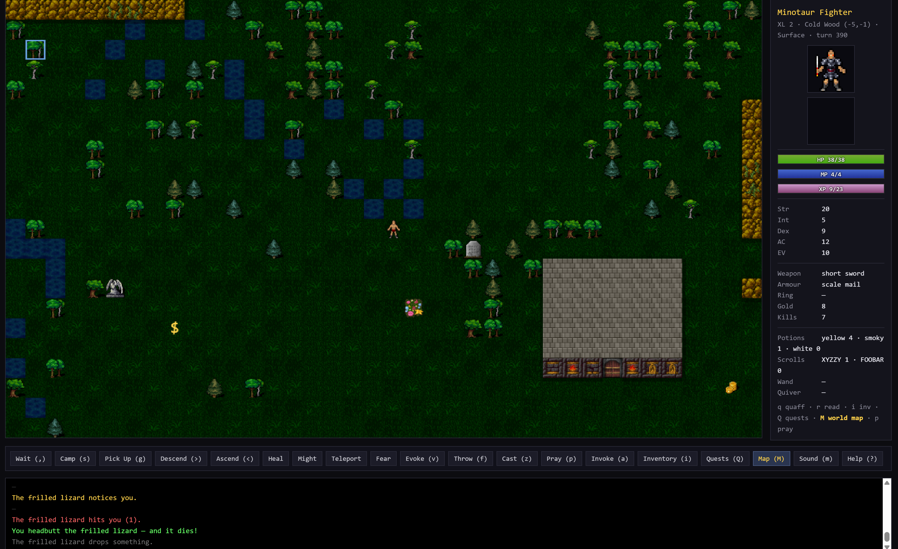

# RPG Stone Soup

A browser-runnable, single-window desktop roguelike built on top of the
**Dungeon Crawl Stone Soup** ([DCSS](https://crawl.develz.org/)) data
export.  It plays in JavaScript in a chromeless browser window, loading
its monster definitions, vault recipes and tile sheets from the same
files DCSS ships.

The binary is **`RpgStoneSoup.exe`** and the window brands as **RPG Stone Soup**.



## What's here

* A 5-floor procedural Dungeon with the Lair / Orc / Crypt / Vaults /
  Swamp / Shoals side-branches.
* An **endless chunked Surface** above D:1 with biomes (plains, forest,
  mountains, swamp, lake, shoals) -- walk off any edge and the world
  keeps going. Biome-specific floor tiles and spawn pools.
* Procedural **buildings**: homes, shops, manors, mansions, ruins and
  proper **castles** with curtain walls, corner towers, courtyards,
  three-piece castle gates, crypt-style doors, and inner keeps.
* **570 monster definitions** with first-sighting lore drops, biome
  gating, hit-arrow blood effects, hp bars over wounded mobs, and
  speech bubbles over NPCs for ambient banter.
* Friendly **NPCs**: questgivers, shopkeepers, wandering children, and
  **Kings** in castles who hand out major retrieve-the-relic quests for
  huge rewards.
* **Neutral guards** (watchmen, knights, paladins, black knights) who
  patrol castles -- they don't fight unless you attack them or get
  caught opening a guarded chest. Theft alerts the rest of the squad.
* Real **quests** (kill / fetch / rescue / retrieve) with a tracked
  compass and a world map (press **M**).
* **Cellars + upper floors** that mirror their source building -- enter
  the stairs of a manor and the second storey is recognisably the same
  house, just with different content.
* **Treasure chests** with multi-item loot, **bosses** rendered at
  2.2x tile size, and **POIs** (wells, shrines, henges, beacons,
  wishing wells, fruit caches, ...) that drain after one use but stay
  on the map.
* **Food + hunger** system with edible items, **clickable inventory
  and shop** (no letter typing required), **damage screen flash**, and
  a full death/win screen with run summary.
* Camp resting (`s`), region names ("Old Marsh"), persistent saves.

## Built-in Chunk Editor

A complete chunk editor ships in the same binary -- open the editor
link on the title screen.

* Paint terrain (28 brushes: floor variants, walls, doors, gateways,
  shallow/deep water, biome floors, teleporters, ...).
* Search the bundled rltiles for art overrides by keyword ("dragon",
  "shoals", "altar") -- the first 50 matches preview live, and many
  brushes paint a *random* variant per cell from arrays.
* Drop entities from a dropdown synced to the live 570-monster set:
  monsters, NPCs, items, food, keys, chests, gold piles.
* NPC dialog editor (custom modal, multi-line) attached per-NPC.
* Teleporter pairs with destination prompts.
* Undo/redo (Ctrl+Z / Ctrl+Y, 40-step buffer).
* Save to localStorage at any `(cx, cy, floor)` tuple -- cellars and
  upper floors supported. The game then loads your custom chunk
  instead of the procedural one at that coord.
* Export / import JSON for sharing chunks.

## Run from source (web only)

You need any modern browser plus a static file server (the game uses
`fetch()` for its data, which most browsers refuse on `file://`).

```
cd web-game
python -m http.server 8000
```

Then open <http://localhost:8000/>.

(On Windows you can also just double-click `server.bat` in `web-game/`.)

## Run from source (desktop)

Builds a single-file `.exe` that opens its own chromeless window:

```
cd web-game
pip install pyinstaller pillow
python build_desktop.py
```

The bundled binary lands in `web-game/dist/RpgStoneSoup.exe`.  Run it from
anywhere -- everything is packed inside (Python, the HTML / JS / CSS,
the editor, and the full ~29 MB rltiles asset tree).

A pre-built `RpgStoneSoup.exe` lives in `release/` for one-double-click
play.

## Tests

```
cd web-game
node test_headless.js
```

A pure-Node harness that loads `game.js` in a VM, runs 150+ scripted
scenarios (combat, vaults, biome spawns, quest accept + turn-in, cellar
descent, chest opening, ...) and an agent simulation across many runs.

## Controls (in-game)

| Key | Action |
|---|---|
| Arrows / hjkl / numpad | move (8 directions) |
| `,` `.` `5` Space | wait one turn |
| `s` | set up camp (rest until full HP/MP or interrupted) |
| `>` `<` | use stairs / enter a branch |
| `g` | pick up |
| `q` then `h`/`m` | quaff healing / might |
| `r` then `t`/`f` | read teleport / fear |
| `v` `f` `z` | evoke wand / throw / cast spell |
| `p` `a` | pray at altar / invoke god |
| `i` | inventory |
| `Q` | quest log |
| **`M`** | **world map** |
| `m` | mute / unmute |
| `?` | in-game help |
| `e` | eat from inventory |
| `B` | bestiary (encountered monsters + lore) -- when present |
| Mouse | click to walk / attack; click yourself to wait |

## Project layout

```
web-game/
  index.html          single-page UI (canvas + sidebar + overlays)
  style.css           dark roguelike skin
  game.js             the whole engine: gen, combat, AI, UI, save
  game-data.json      monster + species + job + god defs (570 monsters)
  vaults.json         vault recipes (handlers for des-style maps)
  editor.html         chunk editor UI
  editor.css          editor styling
  editor.js           editor engine: brushes, undo, save, art search
  tiles/              ~29 MB of art -- everything the editor browses
    dngn/             floor / wall / door / decor (themes + variants)
    item/             potions, scrolls, gold, weapons, food, keys
    effect/           blood arrows + directional animations
    mon/              monster sprites (MONS_<NAME>.png)
    npc/              friendly NPC portraits
    npc_32x32/        pre-resized NPC portraits
    boss/             large boss sprites (rendered at 2.2x)
    knights_tiles/    soldier / knight / spearman / crossbowman source
    player/           player doll layers
    roof/             building roof variants
    manifest.json     tile-key -> path map (editor search index)
  desktop.py          chromeless-browser launcher (Edge --app fallback Chrome)
  build_desktop.py    PyInstaller wrapper -> RpgStoneSoup.exe
  build_game_data.py  rebuilds game-data.json from DCSS source/
  build_vaults.py     rebuilds vaults.json from DCSS source/dat/des/
  build_tiles.py      rebuilds tiles/manifest.json + copies images
  test_headless.js    pure-Node test harness

release/
  RpgStoneSoup.exe        pre-built standalone (~31 MB)
  Play RpgStoneSoup.bat   one-click launcher
  README.txt          end-user readme
```

## Acknowledgements

* All monster stats, attack flavours, religion lines, vault recipes and
  most of the tile art come from
  [Dungeon Crawl Stone Soup](https://crawl.develz.org/) (GPL-2.0+).
* Additional sprite sets (`npc_32x32/`, `boss/`, `knights_tiles/`) come
  from various CC-licensed pixel-art packs.  See each subfolder for
  origin if redistributing the art separately.

## License

GPL-2.0-or-later, matching DCSS.  See `LICENSE`.
